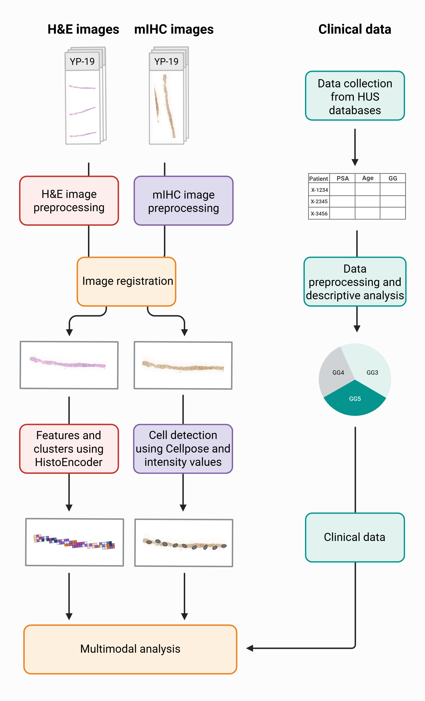

## Multimodal analysis pipeline

The code was originally tailored for the specific dataset used in the Master's thesis, so it may contain dataset specific hard-coded values, such as file name assumptions.

The pipeline consists of different stages/scripts that should be run in a certain order.

### 1. Image preprocessing
Conda environment can be installed from image_preprocessing/preprocessing_environment.yml

#### a. mrxs_to_tif.py
If your H&E images are in MIRAX format, they should be converted into TIFF format be using this script.

#### b. crop_mihc.py
Crops mIHC images based on predefined coordinates. See image_preprocessing/example_mihc_coordinates.csv for the correct structure.

#### c. crop_he.py
Crops H&E images based on predefined coordinates. See image_preprocessing/example_he_coordinates.csv for the correct structure.

#### d. add_metadata_he.py
Adds MPP metadata into cropped H&E images.

### 2. Image registration
Conda environment can be installed from image_registration/registration_environment.yml

#### a. copy_image_groups.py
Copies corresponding H&E and mIHC images into correct subfolders. Note that the script makes certain assumptions about samplenames.

#### b. image_registration.py
Registers images belonging to same subfolders (step 2a). Registration is performed with wsireg [(GitHub)](https://github.com/NHPatterson/wsireg). The script utilizes the predefined initial angles of rotation set in the mIHC coordinate CSV file.

#### c. registration_results_overlaps.py
Visualizes overlaps of the registrated images. H&E tissue section is shown in orange, DAPI in blue and CD3 in purple. Note that if you use other mIHC markers, you must adjust the code accordingly.

### 3. HistoQC
Applies tissue segmentation to the cropped H&E images. Uses configuration file histoqc/mydefault_v2.ini. Command:  
`python -m histoqc -c mydefault_v2.ini -n 3 "*.tif"`  
More information in [HistoQC GitHub](https://github.com/choosehappy/HistoQC)

### 4. HistoPrep and HistoEncoder
#### a. histoprep_script.py
Divides H&E images into tiles. Uses tissue masks generated in step 3.
More information in [HistoPrep GitHub](https://github.com/jopo666/HistoPrep)

#### b. HistoEncoder
Feature extraction from the H&E tiles from step 4a. Command:  
`HistoEncoder extract --input_dir ./tile_images --model-name <model>`, where model can either be prostate_small or prostate_medium.

Tile clustering. Command:  
`HistoEncoder cluster --input_dir ./tile_images`

More information in [HistoEncoder GitHub](https://github.com/jopo666/HistoEncoder)